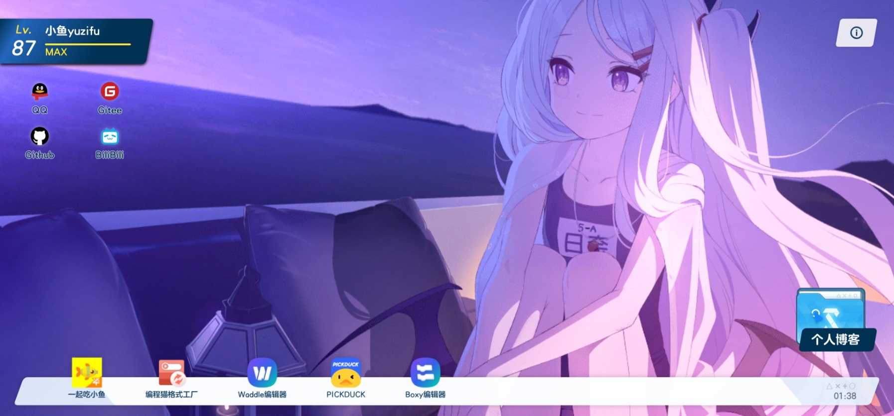

<h1 align="center">小鱼档案</h1>

<p align="center">
<a href='https://gitee.com/sf-yuzifu/homepage/stargazers'></img></a>
<a href='https://github.com/sf-yuzifu/homepage/stargazers'></a>
</p>

<div align="center">有关小鱼的《蔚蓝档案》风格的个人主页</div>



## 预览链接
- [小鱼档案](https://yzf.moe)
- [小鱼档案 - 备用](https://yuzifu.top/)

## 目前复刻程度
- [x] 加载界面
- [x] 主界面复刻
- [x] 回忆大厅
- [x] 弹窗复刻
- [x] 什亭之箱转场
- [x] 点击特效和动效

## 技术栈

- [Vue](https://cn.vuejs.org/)
- [Vite](https://vitejs.cn/vite3-cn/)
- [Arco Design](https://arco.design/)
- [pixi-spine](https://github.com/pixijs/spine)
- [Iconfont](https://www.iconfont.cn/)

## 部署方式

> ### 推荐环境：
> 
> node > 16.16.0  
> npm > 8.15.0

1. 安装yarn
```bash
# 安装 yarn
npm install -g yarn
```
2. 克隆此项目到本地
3. 在项目根目录下运行
```bash
# 安装依赖
yarn install

# 预览（开发环境）
yarn dev

# 构建
yarn build

# 预览（生产环境）
yarn preview
```
> 构建完成后，静态资源会在 **`dist` 目录** 中生成，你可以将 **`dist` 目录中的文件**上传至服务器，也可以使用 `Vercel`、`Netlify` 等静态托管平台一键导入并自动部署

## 个性化
**暂未开放**快速个性化方法，可以自己尝试手动修改 xD