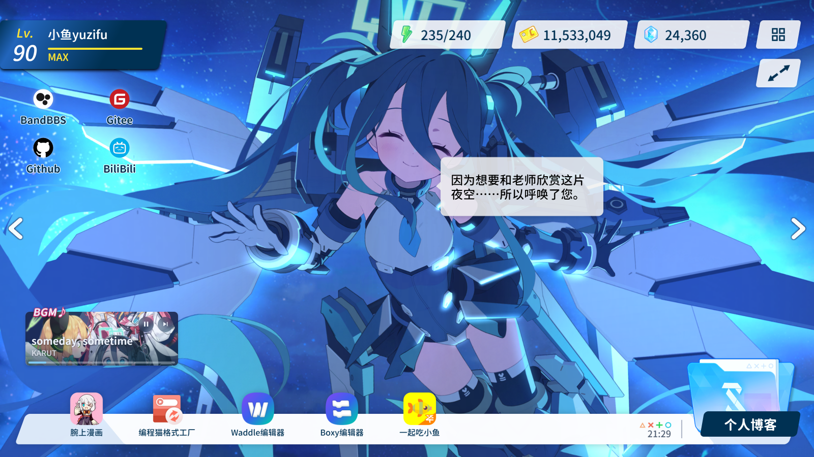

<p align="center">
  <a href="./README.md">简体中文</a> | <a href="./README_EN.md">English</a>
</p>

<h1 align="center">小鱼档案</h1>

<p align="center">
  <a href='https://gitee.com/sf-yuzifu/homepage/stargazers'></a>
  <a href='https://gitee.com/sf-yuzifu/homepage/members'></a>
  <a href='https://github.com/sf-yuzifu/homepage/stargazers'></a>
  <a href='https://github.com/sf-yuzifu/homepage/forks'></a>
  <a href="./LICENSE"></a>
</p>

<div align="center">有关小鱼的《蔚蓝档案》风格的个人主页</div>




## 📖 项目简介

**小鱼档案（Fish Archive）** 是一个高度还原《蔚蓝档案》游戏风格的个人主页。项目基于 **Vue 3 + Vite** 构建，通过 **PIXI.js + Spine** 渲染游戏回忆大厅的骨骼动画（Live2D），并实现了摸头、视线跟随、捏脸、语音对话等一系列互动效果，力求在浏览器中还原游戏内「与学生相处」的沉浸感。

全站内容（站点信息、联系方式、项目展示、音乐列表、Live2D 角色等）均可通过根目录的 **`_config.yaml`** 完成定制（Fork 可参考 **`_config.example.yaml`**），个人简介正文写在 `bio/{语言}.md`，无需改源码即可部署属于你自己的主页。

## ✨ 功能特点

### 🎮 游戏 UI 高度还原

- 加载界面（进度条 + 随机看板头像）
- 主界面复刻（等级 / AP / 信用点 / 青辉石等游戏元素）
- 弹窗复刻与「什亭之箱」幕布转场动画
- 个人简介等二级界面

### 🎭 回忆大厅 Live2D 互动（Spine 渲染）

- 多个学生回忆大厅切换（上一页 / 下一页）
- 全局观赏模式（隐藏 UI，纯享回忆大厅）
- 摸头互动：长按头部区域，学生头部跟随手指
- 点击对话：触发角色台词与语音
- 视线跟随：按住拖动时学生看向触点（参数取自官方资源解包）
- 捏脸 / 特殊骨骼拖拽互动
- 随机眨眼与待机小动作

### 🎵 氛围体验

- Banner 音乐播放器（网易云音乐随机播放）
- 《蔚蓝档案》风格点击特效
- 自定义游戏风格虚拟光标
- 体力 / 信用点 / 青辉石数值系统：体力同步设备电量（不支持时按 6 分钟/点恢复），信用点随停留时长累计，青辉石每日签到领取（本地 localStorage 持久化，悬停可查看说明）

### 🌍 国际化与 PWA

- 内置 简体中文 / 繁體中文 / English / 日本語 四种语言
- 自动检测浏览器语言，语言包按需动态加载
- PWA 离线缓存与站点更新提示

### ⚡ 性能优化

- 中文字体构建时子集化（cn-font-split），按 unicode-range 分片按需加载
- Arco Design 按需引入、路由懒加载、第三方依赖分组分包
- 图片自动优化与 gzip 压缩

## 🔗 在线预览

- [小鱼档案](https://yzf.moe)
- [小鱼档案 - 备用](https://yuzifu.top/)

## 🛠️ 技术栈

| 技术 | 用途 |
| --- | --- |
| [Vue 3](https://cn.vuejs.org/) + [Vue Router](https://router.vuejs.org/zh/) | 前端框架与路由 |
| [Vite](https://vitejs.cn/) | 构建工具 |
| [PIXI.js](https://github.com/pixijs/pixijs) + [spine-pixi-v8](https://www.npmjs.com/package/@esotericsoftware/spine-pixi-v8) | 回忆大厅 Spine 骨骼动画渲染 |
| [Arco Design](https://arco.design/) | UI 组件库（按需引入） |
| [howler.js](https://github.com/goldfire/howler.js) | 音乐播放（自研海报风播放器） / 角色语音播放 |
| [js-yaml](https://github.com/nodeca/js-yaml) | YAML 配置解析 |
| [vite-plugin-pwa](https://github.com/vite-pwa/vite-plugin-pwa) + Workbox | PWA 离线缓存 |
| [cn-font-split](https://github.com/KonghaYao/cn-font-split)（经 vite-plugin-font） | 中文字体子集化 |
| [ba-click-fx](https://github.com/CialloKing/ba-click-fx) | 点击特效 |
| [BlueArchive-Cursors](https://github.com/makipom/BlueArchive-Cursors) | 游戏风格光标 |
| [Resource Han Rounded CN](https://github.com/CyanoHao/Resource-Han-Rounded) | 站点字体 |
| [Iconfont](https://www.iconfont.cn/) | 图标字体库 |

## 🚀 部署方式

### 使用第三方部署平台

#### 1. Vercel

[](https://vercel.com/import/project?template=https://github.com/sf-yuzifu/homepage)

#### 2. Netlify

1. `Fork` [本项目](https://github.com/sf-yuzifu/homepage)
2. [登录 Netlify 控制台](https://app.netlify.com)，选择 `Add new site` - `Import an exist project` 添加网站
3. 接着选择 GitHub 认证来读取我们的 GitHub 项目列表。在列表中搜索我们刚才 `Fork` 生成的仓库名，点击该项目开始基于该仓库创建我们的 Netlify 网站

### History 路由（刷新 `/bio` 不 404）

本站用 Vue Router 的 `createWebHistory`。构建会写出 **`dist/bio/index.html`**（独立 OG 卡片），GitHub Pages 等按目录索引的托管刷新 `/bio` 即可。

其它主机若只认根目录 `index.html`，刷新 `/bio` 会 404。仓库已带回退规则（有真实文件时仍走文件，不会盖掉 `bio/index.html` 和静态资源）：

| 平台 | 文件 |
| --- | --- |
| Vercel | 根目录 `vercel.json`（导入本仓库一般已按 Vite 自动配置；静态上传 `dist` 时靠这份） |
| Netlify / Cloudflare Pages | `public/_redirects`（构建后进入 `dist`） |
| Apache | `public/.htaccess`（构建后进入 `dist`） |

其中 `vercel.json` 的全量回退（`/(.*)` → `/index.html`）依赖 Vercel 的**静态优先**语义：应用 rewrite 前会先查文件系统，命中真实文件（静态资源、`bio/index.html`）时不回退。若把这条规则照搬到只按 rewrite 转发、不查文件的主机 / 网关上，静态资源会被回退成 HTML，需自行收窄 `source` 或改用该主机自己的回退配置。

Nginx / 宝塔把站点根指到 `dist` 后，在 server 里加上：

```nginx
location / {
  try_files $uri $uri/ /index.html;
}
```

子路径部署（如 `https://user.github.io/homepage/`）还需把 Vite `base` 改成对应前缀，本仓库默认站点在域名根路径 `/`。

### 本地构建网页文件

> **推荐环境：**
>
> - node > 18.0.0
> - npm > 8.15.0

1. 安装 yarn

```bash
# 安装 yarn
npm install -g yarn
```

2. 克隆此项目到本地
3. 在项目根目录下运行

```bash
# 安装依赖
yarn install

# 预览（开发环境）
yarn dev

# 构建
yarn build

# 预览（生产环境预览）
yarn preview
```

> 构建完成后，静态资源会在 **`dist` 目录** 中生成，你可以将 **`dist` 目录中的文件** 上传至服务器。
>
> 其中关于宝塔如何部署的（[https://cloud.tencent.com/developer/article/1977167](https://cloud.tencent.com/developer/article/1977167)）

## ⚙️ 个性化

Fork 后主要改两处：

| 文件 | 作用 |
| --- | --- |
| **`_config.example.yaml`** | 字段说明与示例结构；**复制为 `_config.yaml`** 后填写 |
| **`bio/{语言}.md`** | 个人简介正文（Markdown，支持内嵌 HTML） |

修改后 `yarn build` 重新部署即可。构建会校验 `_config.yaml` 与 `public/` 资源路径；缺语言包时简介回退 `bio/en-US.md`。

**Fork 提示：**

- **图标**：默认 `public/js/iconfont.js`（`iconfont: /js/iconfont.js`）；可在 [iconfont.cn](https://www.iconfont.cn/) 自建 Symbol JS 替换，`dock` / `contact` 也可用 `imgSrc`。
- **History 路由 / 子路径 `base`**：见上方「部署方式」。
- **OG 分享卡片**：构建时用 sharp 从 `shots/zh/pic1.png` / `pic2.png` 裁切出 `/og-home.jpg`、`/og-bio.jpg`；换自己的截图请改 `_config.yaml` 的 `og.home` / `og.bio` 指向新路径，勿直接删除源图（缺失会构建失败）。
- **转场视频 `transfrom.mov`**：Safari / iOS 的 HEVC+alpha 转场轨，由 `yarn transition:mov` 从 `public/transfrom.webm` 转出；脚本依赖 macOS 的 `hevc_videotoolbox` 编码器，**仅 macOS 可执行**。不改转场视频则无需理会；要替换请在 macOS 上重新生成（直接删除 `.mov` 会让 Safari 落到无透明通道的 WebM 轨）。

完整字段注释见 **[`_config.example.yaml`](./_config.example.yaml)**。

## 🎮 交互说明

大厅 HUD 展开时（非全屏 Live2D 观赏模式）：

- **← / →**：切换回忆大厅角色（与底部箭头同效；可在 **设置 → 演出 → 方向键切换角色** 关闭；输入框聚焦或设置弹窗打开时不响应）

摸头、视线跟随、点击台词等见上方「功能特点 → 回忆大厅 Live2D 互动」。

## 💾 localStorage

站点在浏览器 `localStorage` 中持久化以下键，便于 Fork 调试或用户自行清档（开发者工具 → Application → Local Storage，删除对应键后刷新）：

| 键 | 格式 | 说明 |
| --- | --- | --- |
| `fa-settings` | JSON | 音量 / 静音、`introMode`（`always` \| `once`）、`introSeen`（是否已看过开场）、`clickEffect`（点击特效）、`lobbyArrowKeys`（← / → 切角色） |
| `fa-locale` | 字符串 | 语言偏好：`auto`（跟随浏览器）或 `zh-CN` / `zh-TW` / `en-US` / `ja-JP` |
| `fa-wallet` | JSON | 钱包：体力 `ap`、恢复时间 `apSettleAt`、信用点 `gold`、陪伴秒数 `dwellSeconds`、青辉石 `pyroxene`、签到 `signInDays` / `lastSignIn` |

多标签页之间会同步 `fa-settings` / `fa-locale` / `fa-wallet` 的变更；删除某个键时，其他已打开的标签页会同步恢复默认值。

## 🌐 有关 i18n

**基础配置 + 语言包覆盖**：`_config.yaml` 放路径与链接；`src/locales/*.yaml` 按语言覆盖标题、按钮文案、`memorialLobbies[].voice` 等；`bio/{locale}.md` 为简介正文。浏览器语言自动匹配，未命中回退英语；语言包独立 chunk 按需加载。

```
src/locales/   zh-CN.yaml  zh-TW.yaml  en-US.yaml  ja-JP.yaml
bio/           zh-CN.md    zh-TW.md    en-US.md    ja-JP.md
```

翻译文件里常见项：`title`、`manifest`、`dock[].name`、`contact[].name`、`task.name`、`memorialLobbies[].name`、`memorialLobbies[N].voice`、`translate.*`（界面字符串）、`bio.btn[].name`。可参考现有 `src/locales/zh-CN.yaml`。

## 🎁 有关学生回忆大厅 L2D 文件获取

1. 自己去游戏解包中获取
2. 去 [基沃托斯古书馆](https://kivo.fun/) 中的 `角色图鉴` — `切换到鉴赏模式` — `回忆大厅` 当中自行抓包获取

## 💖 基于本项目的最佳实践

> 感谢使用此项目的大佬们能够进一步完善这个项目 😭😭😭
>
> 欢迎其他大佬通过 Issue 来向我投稿最佳实践 ❤❤❤

1. [Home - 杏仁レモンティー](https://apricotlemontea.com/)
2. [ElectroHeavenVN's Homepage](https://electroheavenvn.github.io/homepage/)

## 📄 开源协议与版权声明

### 源代码

本仓库的**程序源代码**（Vue / TypeScript / 构建脚本等，不含下述游戏资源文件）以 [MIT License](./LICENSE) 开源。

### 游戏与非代码资源

仓库及示例站点中可能包含的以下内容，版权归 **Nexon / Yostar**（《蔚蓝档案》/ *Blue Archive*）及其关联方所有，**不在 MIT 协议范围内**：

| 类型 | 典型路径 / 位置 |
|------|----------------|
| Spine / Live2D 角色模型与动画 | `public/l2d/` |
| 角色语音 | 各角色 `memorialLobbies[].path` 下的 `zh-CN/`、`ja-JP/`（如 `public/l2d/aris_battle/ja-JP/*.mp3`，文件名为 spine talk 事件 key） |
| 游戏 UI 贴图、幕布、加载素材等 | `public/shitim/`、`public/img/` 部分文件 |
| 角色台词文案 | 语言包 `memorialLobbies[].voice` 等 |

### 使用与 Fork 须知

- 上述资源仅供**个人、非商用**的粉丝向展示；**请勿用于商业用途、付费服务或二次贩卖**。
- **Fork、部署或二次发布者须自行确认**符合所在地法律及 Nexon / Yostar 的相关政策；因使用本仓库游戏资源引发的纠纷或法律责任由**使用者自行承担**。
- 本仓库**不向任何第三方授予**游戏素材的商业许可。公开部署前，建议**替换为你有权使用的素材**，或仅保留代码与配置框架。

其他第三方素材请遵循各自许可（例如 [BlueArchive-Cursors](https://github.com/makipom/BlueArchive-Cursors) 为 MIT、[ba-click-fx](https://www.npmjs.com/package/ba-click-fx) 等见对应仓库）。
