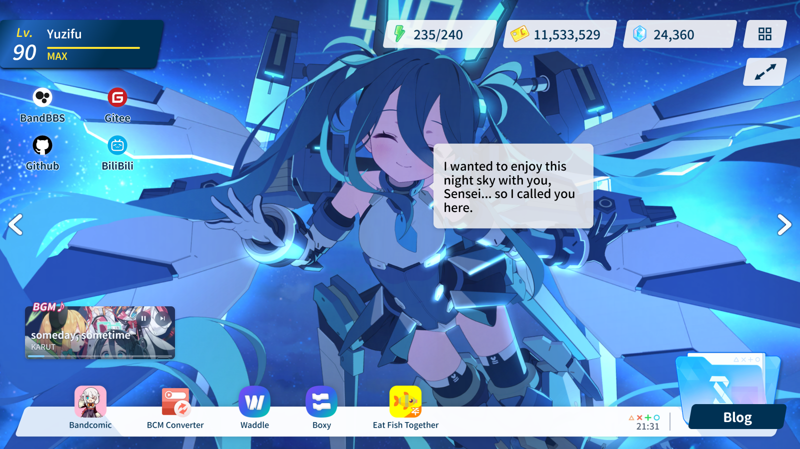

<p align="center">
  <a href="./README.md">简体中文</a> | <a href="./README_EN.md">English</a>
</p>

<h1 align="center">Fish Archive</h1>

<p align="center">
  <a href='https://gitee.com/sf-yuzifu/homepage/stargazers'></a>
  <a href='https://gitee.com/sf-yuzifu/homepage/members'></a>
  <a href='https://github.com/sf-yuzifu/homepage/stargazers'></a>
  <a href='https://github.com/sf-yuzifu/homepage/forks'></a>
  <a href="./LICENSE"></a>
</p>

<div align="center">A Blue Archive-style personal homepage for me.</div>




## 📖 Introduction

**Fish Archive** is a personal homepage that faithfully recreates the style of the game *Blue Archive*. Built with **Vue 3 + Vite**, it renders memorial lobby skeletal animations (Live2D) from the game via **PIXI.js + Spine**, and implements a series of interactive effects such as head-patting, gaze following, cheek dragging, and voice dialogue — striving to reproduce the immersive feeling of "spending time with students" right in your browser.

All site content (site info, contacts, project showcase, music list, Live2D characters, etc.) can be customized through **`_config.yaml`** in the root directory (forks: see **`_config.example.yaml`**). The bio page body lives in `bio/{locale}.md` — deploy your own homepage without touching the source code.

## ✨ Features

### 🎮 Faithful Game UI Recreation

- Loading screen (progress bar + random avatar)
- Main interface recreation (Level / AP / Gold / Pyroxene and other game elements)
- Popup recreation and the "Shittim Chest" curtain transition animation
- Personal bio and other secondary pages

### 🎭 Memorial Lobby Live2D Interactions (Spine Rendering)

- Switch between multiple student memorial lobbies (previous / next page)
- Global viewing mode (hide UI and enjoy the memorial lobby)
- Head-patting: long-press the head area and the student's head follows your finger
- Tap to talk: trigger character lines and voice
- Gaze following: the student looks at your pointer while dragging (parameters extracted from official game resources)
- Cheek dragging / special bone dragging interactions
- Random blinking and idle motions

### 🎵 Atmosphere

- Banner music player (random playback from NetEase Cloud Music)
- Blue Archive-style click effects
- Custom game-style virtual cursor
- Wallet system: AP syncs with your device battery (falls back to recovering 1 AP per 6 minutes), credits accumulate with time spent on site, and pyroxene comes from daily sign-in rewards (persisted in localStorage, hover for details)

### 🌍 i18n & PWA

- Built-in support for 简体中文 / 繁體中文 / English / 日本語
- Automatic browser language detection, with language packs loaded on demand
- PWA offline caching and site update prompts

### ⚡ Performance Optimization

- CJK fonts are subsetted at build time (cn-font-split) and loaded on demand via unicode-range
- Arco Design imported on demand, route-level lazy loading, grouped vendor chunking
- Automatic image optimization and gzip compression

## 🔗 Preview

- [Fish Archive](https://yzf.moe)
- [Fish Archive - Backup](https://yuzifu.top/)

## 🛠️ Tech Stack

| Technology | Purpose |
| --- | --- |
| [Vue 3](https://vuejs.org/) + [Vue Router](https://router.vuejs.org/) | Frontend framework and routing |
| [Vite](https://vitejs.dev/) | Build tool |
| [PIXI.js](https://github.com/pixijs/pixijs) + [spine-pixi-v8](https://www.npmjs.com/package/@esotericsoftware/spine-pixi-v8) | Memorial lobby Spine skeletal animation rendering |
| [Arco Design](https://arco.design/) | UI component library (imported on demand) |
| [howler.js](https://github.com/goldfire/howler.js) | Music playback (custom poster-style player) / character voice playback |
| [js-yaml](https://github.com/nodeca/js-yaml) | YAML configuration parsing |
| [vite-plugin-pwa](https://github.com/vite-pwa/vite-plugin-pwa) + Workbox | PWA offline caching |
| [cn-font-split](https://github.com/KonghaYao/cn-font-split) (via vite-plugin-font) | CJK font subsetting |
| [ba-click-fx](https://github.com/CialloKing/ba-click-fx) | Click effects |
| [BlueArchive-Cursors](https://github.com/makipom/BlueArchive-Cursors) | Game-style cursors |
| [Resource Han Rounded CN](https://github.com/CyanoHao/Resource-Han-Rounded) | Site font |
| [Iconfont](https://www.iconfont.cn/) | Icon font library |

## 🚀 Deployment

### Using Third-Party Deployment Platforms

#### 1. Vercel

[](https://vercel.com/import/project?template=https://github.com/sf-yuzifu/homepage)

#### 2. Netlify

1. `Fork` [this project](https://github.com/sf-yuzifu/homepage)
2. [Log in to Netlify Console](https://app.netlify.com), select `Add new site` - `Import an exist project` to add a website
3. Then select GitHub authentication to read our GitHub project list. Search for the repository name we just `Fork`ed in the list, click on the project to start creating our Netlify website based on that repository

### History routes (refresh `/bio` without 404)

The app uses Vue Router `createWebHistory`. The build writes **`dist/bio/index.html`** (its own OG tags), so hosts that serve directory indexes (GitHub Pages, etc.) already work on refresh.

Hosts that only know about the root `index.html` will 404 on `/bio`. This repo ships SPA fallbacks (real files still win, so `bio/index.html` and assets are not overwritten):

| Platform | File |
| --- | --- |
| Vercel | `vercel.json` at the repo root (the Vite preset usually covers git imports; this file matters when you upload `dist` as static files) |
| Netlify / Cloudflare Pages | `public/_redirects` (copied into `dist`) |
| Apache | `public/.htaccess` (copied into `dist`) |

The catch-all fallback in `vercel.json` (`/(.*)` → `/index.html`) relies on Vercel's **static-first** semantics: the filesystem is checked before rewrites apply, so real files (assets, `bio/index.html`) are never rewritten. If you copy this rule to a host or gateway that forwards by rewrite alone without a filesystem check, static assets would be rewritten to HTML — narrow the `source` yourself or use that host's own fallback config instead.

Nginx / BtPanel — point the site root at `dist` and add:

```nginx
location / {
  try_files $uri $uri/ /index.html;
}
```

Subpath deploys (e.g. `https://user.github.io/homepage/`) also need Vite `base` set to that prefix. This repo assumes the site lives at `/`.

### Local Build

> **Recommended Environment:**
>
> - node > 18.0.0
> - npm > 8.15.0

1. Install yarn

```bash
# Install yarn
npm install -g yarn
```

2. Clone this project to your local machine
3. Run the following commands in the project root directory

```bash
# Install dependencies
yarn install

# Preview (development environment)
yarn dev

# Build
yarn build

# Preview (production environment preview)
yarn preview
```

> After the build is complete, static resources will be generated in the **`dist` directory**. You can upload the **files in the `dist` directory** to your server.
>
> For how to deploy on BtPanel, see ([https://cloud.tencent.com/developer/article/1977167](https://cloud.tencent.com/developer/article/1977167))

## ⚙️ Customization

After forking, edit mainly:

| File | Purpose |
| --- | --- |
| **`_config.example.yaml`** | Field reference and sample structure — **copy to `_config.yaml`** and fill in |
| **`bio/{locale}.md`** | Bio page body (Markdown; inline HTML OK) |

Run `yarn build` and redeploy. The build validates `_config.yaml` and `public/` asset paths. Missing bio locales fall back to `bio/en-US.md`.

**Forking notes:**

- **Icons**: Default `public/js/iconfont.js` (`iconfont: /js/iconfont.js`). Use your own [iconfont.cn](https://www.iconfont.cn/) Symbol JS export, or `imgSrc` on `dock` / `contact` items.
- **History routes / subpath `base`**: see **Deployment** above.
- **OG share cards**: at build time, sharp crops `shots/zh/pic1.png` / `pic2.png` into `/og-home.jpg` and `/og-bio.jpg`. To use your own screenshots, point `og.home` / `og.bio` in `_config.yaml` at the new paths — do not delete the source files (the build fails if they are missing).
- **Transition video `transfrom.mov`**: the HEVC+alpha transition track for Safari / iOS, regenerated from `public/transfrom.webm` via `yarn transition:mov`. The script relies on macOS's `hevc_videotoolbox` encoder, so **it only runs on macOS**. Ignore it if you keep the default transition; to replace it, regenerate the `.mov` on a Mac (deleting the `.mov` outright makes Safari fall back to the WebM track without an alpha channel).

Full field comments: **[`_config.example.yaml`](./_config.example.yaml)**.

## 🎮 Interaction

When the lobby HUD is visible (not in full-screen Live2D-only mode):

- **← / →**: switch memorial lobby character (same as the on-screen arrows; disable under **Settings → Presentation → Arrow keys**; ignored while typing or when the settings modal is open)

Head-pat, gaze follow, tap-to-talk, etc. are listed under **Features → Memorial lobby Live2D**.

## 💾 localStorage

The site persists data in browser `localStorage`. Forkers and users can clear entries via DevTools → Application → Local Storage, then reload:

| Key | Format | Purpose |
| --- | --- | --- |
| `fa-settings` | JSON | Volume / mute, `introMode` (`always` \| `once`), `introSeen`, `clickEffect`, `lobbyArrowKeys` (← / → character switch) |
| `fa-locale` | string | Language: `auto` or `zh-CN` / `zh-TW` / `en-US` / `ja-JP` |
| `fa-wallet` | JSON | Wallet: `ap`, `apSettleAt`, `gold`, `dwellSeconds`, `pyroxene`, `signInDays`, `lastSignIn` |

Changes to these keys sync across open tabs; deleting a key makes other open tabs fall back to defaults as well.

## 🌐 About i18n

**Base config + language pack overrides**: `_config.yaml` holds paths and links; `src/locales/*.yaml` overrides titles, UI strings, `memorialLobbies[].voice`, etc.; `bio/{locale}.md` is the bio body. Browser language is auto-detected; unmatched locales fall back to English. Language packs are separate chunks loaded on demand.

```
src/locales/   zh-CN.yaml  zh-TW.yaml  en-US.yaml  ja-JP.yaml
bio/           zh-CN.md    zh-TW.md    en-US.md    ja-JP.md
```

Typical keys in locale files: `title`, `manifest`, `dock[].name`, `contact[].name`, `task.name`, `memorialLobbies[].name`, `memorialLobbies[N].voice`, `translate.*`, `bio.btn[].name`. See `src/locales/en-US.yaml` for a full example.

## 🎁 About Student Memorial Lobby L2D File Acquisition

1. Extract from the game yourself
2. Go to [Kivotos Library](https://kivo.fun/), navigate to `Character Collection` — `Switch to Appreciation Mode` — `Memorial Lobby` to capture the files yourself

## 💖 Best Practices Based on This Project

> Thank you to all the experts who use this project for further improving it 😭😭😭
>
> Welcome other experts to submit best practices through Issues ❤❤❤

1. [Home - 杏仁レモンティー](https://apricotlemontea.com/)
2. [ElectroHeavenVN's Homepage](https://electroheavenvn.github.io/homepage/)

## 📄 License & Copyright Notice

### Source code

The **program source code** in this repository (Vue / TypeScript / build scripts, etc., excluding game asset files below) is released under the [MIT License](./LICENSE).

### Game and non-code assets

The following materials that may appear in this repository or on the demo site are owned by **Nexon / Yostar** (*Blue Archive* / 《蔚蓝档案》) and related rights holders. They are **not** covered by the MIT license:

| Type | Typical paths |
|------|----------------|
| Spine / Live2D character models & animations | `public/l2d/` |
| Character voice lines | `zh-CN/` / `ja-JP/` under each character's `memorialLobbies[].path` (e.g. `public/l2d/aris_battle/ja-JP/*.mp3`, named after spine talk event keys) |
| In-game UI art, curtains, loading assets, etc. | `public/shitim/`, parts of `public/img/` |
| Character dialogue text | Locale `memorialLobbies[].voice`, etc. |

### Use & forking

- These assets are for **personal, non-commercial** fan display only. **Do not use them commercially**, in paid services, or for resale.
- **If you fork, deploy, or redistribute**, you are **solely responsible** for complying with applicable law and Nexon / Yostar policies. The maintainers are not liable for claims arising from your use of game assets.
- This repo **does not grant** any commercial license for game materials. Before going public, **replace assets you are not entitled to use**, or ship only the code/config scaffold.

Other third-party assets follow their own licenses (e.g. [BlueArchive-Cursors](https://github.com/makipom/BlueArchive-Cursors) is MIT; see each package’s repo for npm deps such as [ba-click-fx](https://www.npmjs.com/package/ba-click-fx)).
